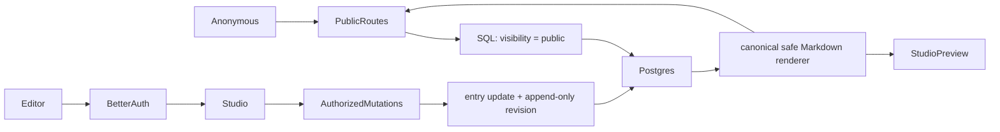

# Architecture

Velvet Crowbar is one Next.js App Router application. Public reading and the
private studio share rendering primitives but never share query permissions.

## Route and component boundaries

`src/app` composes pages and metadata. Public indexes and details are dynamic
Server Components so the build never queries PostgreSQL. Interactive sign-in,
sign-out, and editor forms are the only Client Components. The auth route mounts
Better Auth’s supported Next handler. `/api/health` is metadata-only.

`src/features/entries` owns validation, persistence transactions, paths, and
Server Actions. `src/db` owns the Drizzle schema, client, and deliberately
separate public/studio queries. No generic repository layer hides visibility
logic.

`publication-policy.ts` is the framework-independent owner of routed public
kinds and publication chronology. The repository parses inputs again at the
authoritative mutation boundary. The studio mirrors those rules but is not
trusted to enforce them.

## Authentication flow

Better Auth stores users, credentials, and sessions in the same PostgreSQL
database. The running configuration sets `disableSignUp: true`. `/studio`
layouts call `requireEditor` on the server; it obtains the Better Auth session
and then compares the normalized email to `ADMIN_EMAIL`. Every Server Action
repeats the check. Client navigation never grants authority.

The explicit CLI bootstrap creates the first and only user using a transient
Better Auth configuration that permits sign-up. It first proves the user table
is empty and the supplied email matches `ADMIN_EMAIL`.

The separate operator reset command proves exactly one matching user exists,
then uses Better Auth’s reset-token and credential-account APIs; Better Auth
hashes the replacement and revokes all sessions. Neither capability creates a
running-app sign-up or self-service reset flow. Better Auth’s `rateLimit` model
is stored in PostgreSQL for preview and production so state survives serverless
instance replacement. Development keeps the limiter disabled with its memory
store unless a focused test explicitly enables database storage.

## Content and revisions

`entries` uses ordinary typed columns for editorial content. `entry_revisions`
stores an append-only JSONB snapshot because a historical snapshot is one
cohesive versioned value; active content is not a JSON blob. Create and update
operations write the entry and revision inside one Drizzle transaction. A
database check constraint rejects public entries without publication time,
review time, and reviewing user.

Only translations and essays have public routes and may be saved public.
Private/draft translations may be partial; all four structured fields are
required when public. A public-to-public save preserves `publishedAt` while
updating review identity/time and appending a revision. Withdrawal retains the
historical fields but the SQL visibility predicate removes the entry
immediately. A later nonpublic-to-public transition is deliberate republication
and receives a new `publishedAt`.

Physical deletion and one-click restore are deferred. A public entry becomes
anonymous-invisible by changing its visibility to `draft` or `private`.

## Markdown and public metadata

`src/components/markdown.tsx` is the only renderer for public bodies, studio
preview, and revision preview. It supports GFM, skips raw HTML, rejects unsafe
schemes, suppresses images, and adds safe attributes to external links. No MDX
or arbitrary component execution exists.

Metadata functions fetch through the public slug query. Sitemap and Atom feed
use the public list query. They never query IDs, titles, tags, or timestamps from
draft/private rows.

The anonymous query module returns a typed available/unavailable result. An
available empty list is a real empty-publication state; a failed read renders a
restrained unavailable state and emits only operation, kind, environment, and
constrained error class. Available/not-found alone becomes a 404. Sitemap and
feed throw a safe temporary error instead of emitting a misleading empty
document. Public SQL also excludes any historical unsupported kind.

## Environment and build boundary

Runtime server environment parsing is strict. Development can use documented
localhost defaults; preview and production cannot. The Next build phase receives
a non-routable local placeholder solely so modules can be analyzed. Postgres.js
is lazy and opens no socket during build. Dynamic page rendering performs real
runtime reads and distinguishes empty/not-found from temporary unavailability
without connection details. `next.config.ts` applies the static header policy to
pages, assets, and route handlers; production alone receives HSTS.

## Ownership map / find-it drill

| Concern                        | Authoritative file or symbol                                    |
| ------------------------------ | --------------------------------------------------------------- |
| Entry/revision/auth schema     | `src/db/schema.ts`                                              |
| Visibility and kind validation | `src/features/entries/entry-validation.ts`                      |
| Publication routes/chronology  | `src/features/entries/publication-policy.ts`                    |
| Anonymous visibility predicate | `src/db/queries/public.ts`                                      |
| Studio queries                 | `src/db/queries/studio.ts`                                      |
| Editor authorization           | `src/lib/authorization.ts`                                      |
| Auth configuration             | `src/lib/auth.ts`                                               |
| Auth deployment policy         | `src/lib/auth-policy.ts`                                        |
| Response security headers      | `src/lib/security-headers.ts`, `next.config.ts`                 |
| Editor mutation transaction    | `src/features/entries/repository.ts`                            |
| Server Actions                 | `src/features/entries/actions.ts`                               |
| Markdown renderer              | `src/components/markdown.tsx`                                   |
| Public translation structure   | `src/components/translation-entry.tsx`                          |
| Studio form / preview          | `src/components/studio-entry-form.tsx`                          |
| Publication checklist          | `src/components/publication-checklist.tsx`                      |
| Sitemap / feed                 | `src/app/sitemap.ts`, `src/app/feed.xml/route.ts`               |
| Environment validation         | `src/lib/env.ts`                                                |
| Migrations                     | `drizzle/*.sql`                                                 |
| Seed/operator auth scripts     | `scripts/db-seed.ts`, `scripts/admin-*.ts`                      |
| Tests                          | `tests/unit`, `tests/integration`, `tests/e2e`                  |
| Export                         | `.agents/skills/repo-export/SKILL.md`, `scripts/repo-export.ts` |
| Roadmap recipe                 | `docs/CHANGE-RECIPES.md`                                        |
